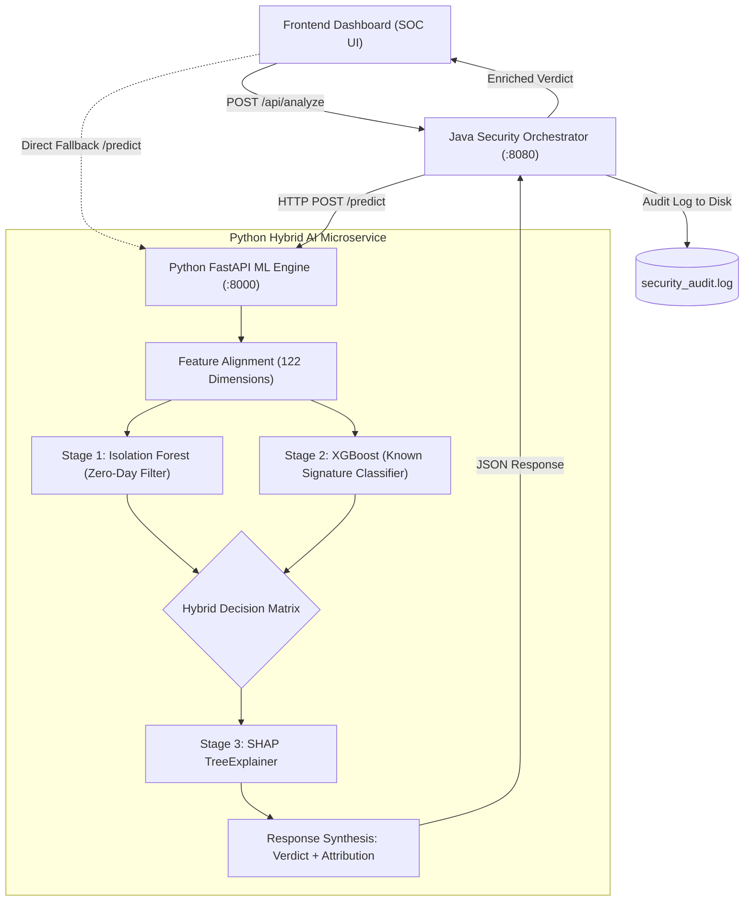

# ZeroGuard: Java-Based Hybrid Machine Learning Framework for Zero-Day Network Attack Detection

A high-performance, explainable intrusion detection platform designed to identify both **known attacks** and **novel Zero-Day network exploits** using a hybrid architecture combining unsupervised anomaly detection, supervised gradient boosting, and SHAP decision explainability.

---

## 🏛️ System Architecture



---

## 📁 Repository Structure

```
ZeroGuard/
├── app.py                      # Phase 3: FastAPI ML microservice (Isolation Forest + XGBoost + SHAP)
├── train.py                    # Phase 2: Model training, evaluation & artifact serialization
├── preprocess.py               # Phase 1: NSL-KDD dataset loading, cleaning & standard scaling
├── start_all.sh                # 1-click startup script for the entire platform
├── requirements.txt            # Python dependencies (FastAPI, Scikit-Learn, XGBoost, SHAP, etc.)
│
├── java_backend/               # Phase 4: Core Java Orchestrator Backend
│   ├── pom.xml                 # Maven build definition
│   ├── run_backend.sh          # Standalone Java compilation and runner script
│   └── src/main/java/com/security/orchestrator/
│       ├── OrchestratorServer.java        # Main HTTP Server entrypoint (:8080)
│       ├── NetworkTrafficController.java  # Request routing, JSON formatting & CORS
│       ├── MlServiceClient.java           # Synchronous HttpClient for FastAPI
│       └── SecurityAuditLogger.java       # Local disk audit logging
│
├── frontend/                   # Phase 5: React + Vite Cybersecurity SOC Dashboard
│   ├── index.html              # Entry HTML
│   ├── src/                    # React components (LiveTrafficFeed, ControlPanel, etc.)
│   ├── package.json            # Frontend dependencies
│   └── vite.config.js          # Vite build config
│
├── models/                     # Serialized Model Artifacts
│   ├── isolation_forest.joblib # Trained Unsupervised Outlier Detector
│   ├── xgboost_model.joblib    # Trained Supervised Attack Classifier (99.91% Accuracy)
│   ├── shap_explainer.joblib   # Serialized SHAP TreeExplainer
│   ├── metadata.json           # Feature schema mapping (122 dimensions)
│   ├── sample_presets.json     # 1-click simulation payloads
│   └── shap_summary_plot.png   # SHAP feature importance plot
│
└── KDDTrain+.txt               # Raw NSL-KDD dataset
```

---

## 🚀 Step-by-Step Execution Guide

### 1. Install Python Dependencies
```bash
pip install -r requirements.txt
```

### 2. (Optional) Re-run Data Preprocessing (Phase 1)
```bash
python3 preprocess.py
```

### 3. (Optional) Re-train Hybrid AI Models (Phase 2)
```bash
python3 train.py
```

### 4. Launch the Complete System (Phases 3, 4, & 5)
Run the launcher script:
```bash
./start_all.sh
```

Or run each service individually:
- **Python FastAPI Engine**:
  ```bash
  uvicorn app:app --host 0.0.0.0 --port 8000
  ```
- **Java Orchestrator**:
  ```bash
  ./java_backend/run_backend.sh
  ```
- **Frontend Dashboard**:
  Open `frontend/index.html` in any modern web browser or serve via `python3 -m http.server 3000 --directory frontend`.

---

## 🔬 Hybrid Decision Logic

| Isolation Forest (Unsupervised) | XGBoost (Supervised) | Threat Category | Verdict |
| :--- | :--- | :--- | :--- |
| **Anomaly (-1)** | **Normal (0)** | `Zero-Day Threat` | 🚨 Novel Zero-Day Exploit (Outlier without known signature) |
| **Anomaly (-1)** | **Malicious (1)** | `Known Attack` | ⚠️ High-Confidence Known Intrusion (Neptune, Portsweep, etc.) |
| **Normal (1)** | **Malicious (1)** | `Known Attack` | ⚠️ Supervised Classifier Signature Match |
| **Normal (1)** | **Normal (0)** | `Normal Traffic` | 🟢 Benign Network Flow Verified |
